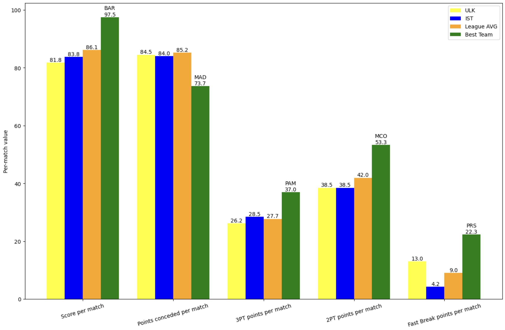

# 🏀 EuroLeague Statistics Analysis

A Python-based data analysis tool that fetches and analyzes EuroLeague basketball game statistics using the official EuroLeague API.

## 📋 Overview

This project collects detailed game statistics from the first 35 games of the 2024-2025 EuroLeague season and performs comprehensive analysis including:

- 📊 Per-game scoring averages
- 🛡️ Defensive performance metrics
- 🎯 2-point and 3-point shooting analysis
- ⚡ Fast break points tracking
- 👥 Player-level 3-point statistics
- 📈 Visual comparison charts

## ✨ Features

- **🔄 Data Collection**: Automatically fetches game data from the EuroLeague API for specified season
- **📐 Statistical Analysis**: Calculates team averages, league-wide metrics, and identifies top performers
- **⚖️ Team Comparison**: Includes dedicated analysis for ULK (Ülkerspor) and IST (Fenerbahçe Beko Istanbul)
- **📊 Visualization**: Generates comprehensive comparison charts showing team performance against league averages
- **🏆 Player Rankings**: Identifies top 3-point shooters across the league

## 📦 Requirements

```
requests
pandas
matplotlib
numpy
```

Install dependencies using:
```bash
pip install requests pandas matplotlib numpy
```

## 🚀 Usage

Run the script directly:
```bash
python euroleague_stats.py
```

The script will:
1. Fetch data for 35 games from the EuroLeague API
2. Process and clean the data
3. Calculate various statistical metrics
4. Generate a visualization chart
5. Display top 3-point shooters (minimum 6.0 average points)

## 📊 Data Structure

The script fetches data from the EuroLeague Points API:
```
https://live.euroleague.net/api/Points?gamecode={game_code}&seasoncode={seasoncode}
```

Key columns in the dataset:
- `GAME_CODE`: Game identifier
- `SEASON_CODE`: Season identifier (E2025)
- `TEAM`: Team name (normalized to uppercase)
- `PLAYER`: Player name
- `POINTS`: Points scored
- `ACTION`: Type of scoring action (Two Pointer, Three Pointer, Free Throw, etc.)
- `FASTBREAK`: Indicator for fast break points
- `POINTS_A`, `POINTS_B`: Team A and Team B total points

## 📈 Key Metrics

The analysis produces the following metrics:

### 🔴 Offensive Metrics
- Average points per game per team
- 3-point average per game
- 2-point average per game
- Fast break points average per game

### 🔵 Defensive Metrics
- Average points conceded per game

### ⚙️ Comparative Data
- League-wide averages
- Best performing teams in each category
- Team-specific metrics for ULK and IST

## 📤 Output

The script generates:

### 1️⃣ Comparative Performance Chart



A bar chart comparing key metrics between teams:
- 🎯 Score per match
- 🛡️ Points conceded per match
- 🎪 3PT points per match
- 💪 2PT points per match
- ⚡ Fast Break points per match

The chart includes four comparison categories:
- **🟨 ULK** (Yellow bars): Ülkerspor performance
- **🔵 IST** (Blue bars): Fenerbahçe Beko Istanbul performance
- **🟠 League AVG** (Orange bars): League-wide averages
- **🟢 Best Team** (Green bars): Top performing team in each category

### 2️⃣ Top 3-Point Shooters Table
🏆 Top performers in 3-point shooting (6.0+ average points per game, excluding ULK):

| TEAM | PLAYER | AVG_3PT |
|------|--------|---------|
| 🥇 PRS | HIFI, NADIR | 13.00 |
| 🥈 MUN | OBST, ANDREAS | 11.25 |
| 🥉 ASV | SELJAAS, ZACHARY | 11.00 |
| BAS | LUWAWU-CABARROT, TIMOTHE | 10.00 |
| BAR | CLYBURN, WILL | 9.00 |

## ⚙️ Configuration

To modify the analysis:
- Change `game_count` range in the while loop to fetch different numbers of games
- Modify `seasoncode` variable to analyze different seasons (e.g., "E2024")
- Adjust the `playerlist_3pt_avg` filter threshold from 6.0 to different values
- Update team filtering logic to include/exclude specific teams

## 🛠️ Error Handling

The script includes try-except error handling for API request failures. If an error occurs, it will print the exception details and halt execution.

## ⏱️ API Rate Limiting

The script includes a 0.25-second delay between API requests to be respectful of server resources and avoid overwhelming the service.

## 📡 Data Source

Data is sourced from the official EuroLeague API: https://live.euroleague.net/api/
